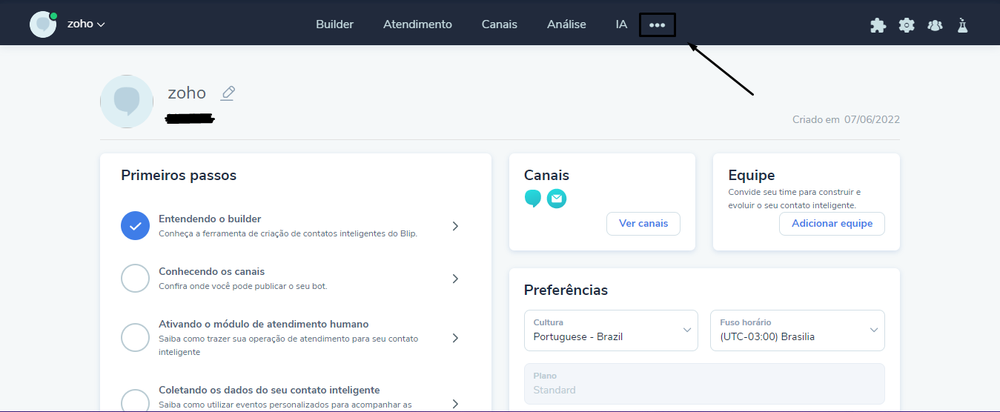
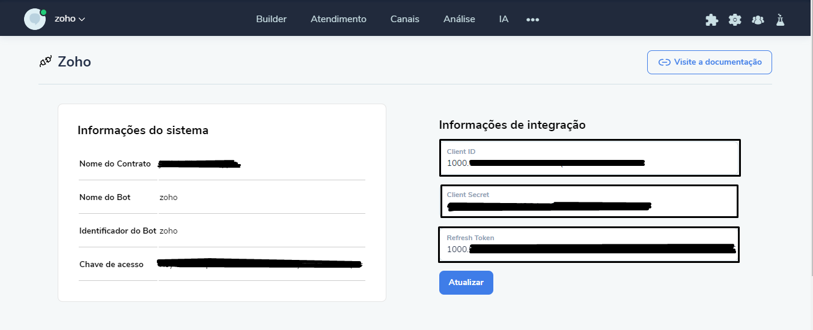
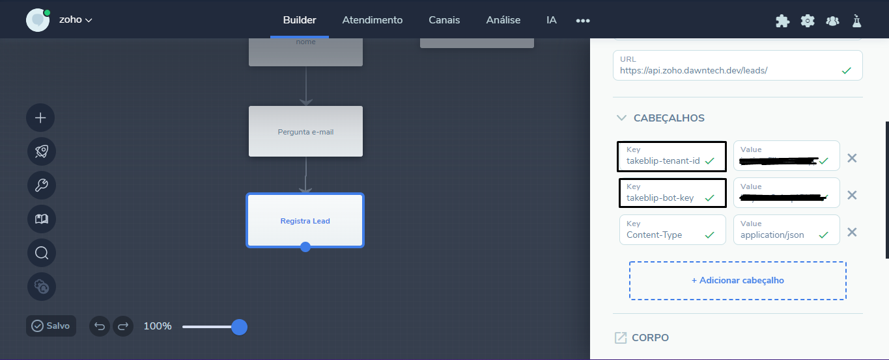
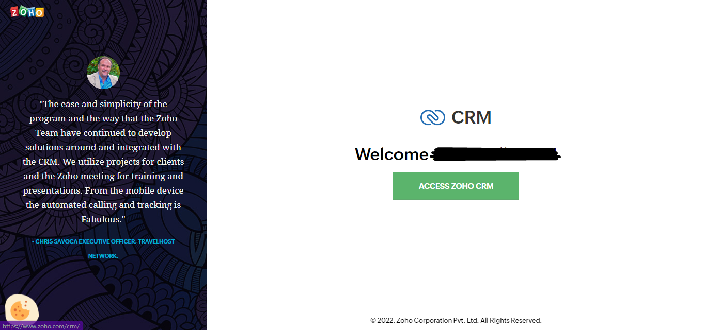
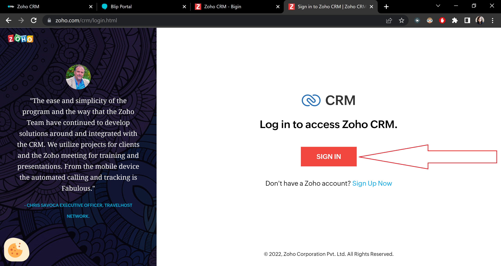
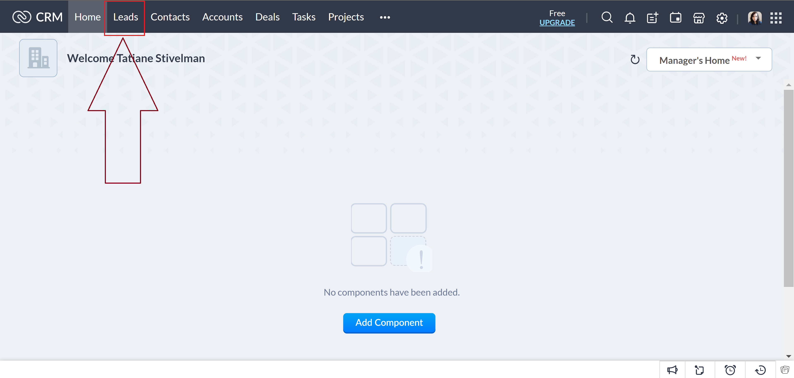

# Como configurar
## Configurações iniciais
1. Crie uma conta em <https://www.zoho.com/pt-br/crm/>, não é necessário carregar os dados da amostra.
2. Vá para <https://api-console.zoho.com/> e clique em 'GET STARTED'.
3. Clique na opção 'Self Client' e clique em 'CREATE'.
4. Se for redirecionado para a página abaixo, clique em 'OK'.

    

    Você será redirecionado para essa página:

    

5. Clique em 'Generate Code'.

    

    Você vai para uma tela assim:

    

6. No campo 'Scope' você vai definir quais operações o client terá permissão para executar, preencha com o seguinte:
`ZohoCRM.modules.ALL,ZohoCRM.settings.ALL,ZohoCRM.notifications.READ,ZohoCRM.notifications.CREATE,ZohoCRM.notifications.UPDATE,ZohoCRM.notifications.DELETE,ZohoCRM.users.ALL,ZohoCRM.org.ALL,ZohoCRM.bulk.ALL,ZohoCRM.coql.READ,ZohoFiles.files.ALL `
7. Em 'Time Duration' escolha '10 minutes'.
8. Em 'Scope Description' coloque o que quiser que caracterize o client (não aparecerá para mais ninguém além de você).
9. A tela deve estar assim agora:

    

    Role a janela para baixo até encontrar o botão 'CREATE' e clique nesse botão.

10. Nessa tela, clique em 'CRM'

    

    Depois, em 'Production', clique no nome da sua empresa.

    

    Role a janela para baixo até encontrar o botão 'CREATE' e clique nesse botão.

11. Será gerado um código, que expira em 10 minutos (tempo que foi preenchido no passo 7 desse tutorial), copie esse código:

    

12. Agora abra o Postman, ou software similar e faça uma requisição com as seguintes informações:
    - Método: `POST`
    - URL: `https://accounts.zoho.com/oauth/v2/token`
    - Headers: `Content-Type: application/x-www-form-urlencoded`
    - Body: no formato `x-www-form-urlencoded` com as seguintes keys:
        * code: é o código recém copiado do Zoho.
        * redirect_url: uma url que não é usada nesse middleware, então pode usar um valor qualquer.
        * client_id: valor que pode ser encontrado em 'Client Secret' (ver imagem abaixo).
        * client_secret: valor que também pode ser encontrado em 'Client Secret' (ver imagem abaixo).
        * grant_type: `authorization_code`

        
        Vai direcionar para a tela exibida no passo 4 desse tutorial.

    * A request ficará nesse formato:
    
    
    
    * A response esperada é:
    
    

    Guarde o refresh_token

13. Acesse <https://portal.blip.ai//> e se já não estiver logado, faça login. 
14. Clique nos três pontos no canto direito superior e vá no local desejado.

    

15. Preencha os 3 campos.
     - client_id e client_secret: mesmos valores que os utilizados no passo 12 desse tutorial.
     - refresh_token: `refresh_token` que veio na response do passo 12 desse tutorial.

    

16. Clique em 'Atualizar'.

## Registro de leads no Blip

Faça uma requisição HTTP de acordo com a seguinte imagem:



Onde config.url tem que ser https://api.zoho.dawntech.dev e config.user é o ID mencionado no passo 13 das configurações iniciais. Vale destacar que É NECESSÁRIO QUE O contact.identity SEJA ENVIADO NO CAMPO "Secondary_Email".

# Controle de leads pela plataforma Zoho

1. Acesse o site <https://www.zoho.com/crm/login.html>.

    - Se você já estiver logado, aperte o botão "ACCESS ZOHO CRM".
    
    

    - Se você não estiver logado, clique em "SIGN IN" e faça o login usando os dados cadastrados no passo 1 das configurações iniciais.

    

2. Clique em "Leads" na barra superior.

    

3. Clique no lead que quiser modificar.

# Documentação de rotas

## Inserção de leads

- Método: `POST`
- URL: `https://api.zoho.dawntech.dev/leads`
- Headers: 
  - `takeblip-tenant-id: <tenant_id>`
  - `takeblip-bot-key: <bot_key>`
- Body:
```
{
    "Last_Name": string | Last name of the lead,
    "First_Name": string | First name of the lead,
    "Email": string | Email of the lead,
    "Secondary_Email": string | AQUI É IMPORTANTE QUE SEJA O contact.identity,
    "Lead_Status": string* | Status of the lead,
    "Company": string | Company where the lead works
}
```

## Atualização de leads
- Método: `PUT`
- URL: `https://api.zoho.dawntech.dev/leads/:<id_do_lead_a_ser_atualizado>`
- Headers: 
  - `takeblip-tenant-id: <tenant_id>`
  - `takeblip-bot-key: <bot_key>`
- Body:
```
{
    "Last_Name": string | Last name of the lead,
    "First_Name": string | First name of the lead,
    "Email": string | Email of the lead,
    "Lead_Status": string* | Status of the lead,
    "Company": string | Company where the lead works
}
```
*Possible values for Lead_Status: "Attempted to Contact", "Contact in Future", "Contacted", "Junk Lead", "Lost Lead", "Not Contacted", "Pre-Qualified", "Not Qualified".

## Busca de leads
- Método: `GET`
- URL: `https://api.zoho.dawntech.dev/leads`
- Headers: 
  - `takeblip-tenant-id: <tenant_id>`
  - `takeblip-bot-key: <bot_key>`

## Procura de leads
- Método: `GET`
- URL: `https://api.zoho.dawntech.dev/leads/search?word=<termo_a_ser_procurado>`
- Headers: 
  - `takeblip-tenant-id: <tenant_id>`
  - `takeblip-bot-key: <bot_key>`

## Remoção de lead
- Método: `DELETE`
- URL: `https://api.zoho.dawntech.dev/leads/:<id_do_lead_a_ser_deletado>`
- Headers: 
  - `takeblip-tenant-id: <tenant_id>`
  - `takeblip-bot-key: <bot_key>`
