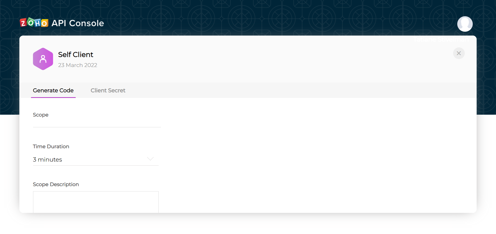

<!--- Plugin Zoho CRM --->
## Como configurar

1. Crie uma conta em https://www.zoho.com/pt-br/crm/, não é necessário carregar os dados da amostra.
2. Vá para https://api-console.zoho.com/ e clique em 'GET STARTED'.
3. Clique na opção 'Self Client' e clique em 'CREATE'.
4. Se for redirecionado para a página abaixo, clique em 'OK'.

    

    Você será redirecionado para essa página:

    

5. Clique em 'Generate Code'.

    

    Você vai para uma tela assim:

    

6. No campo 'Scope' você vai definir quais operações o client terá permissão para executar, preencha com o seguinte:
`ZohoCRM.modules.ALL,ZohoCRM.settings.ALL,ZohoCRM.notifications.READ,ZohoCRM.notifications.CREATE,ZohoCRM.notifications.UPDATE,ZohoCRM.notifications.DELETE,ZohoCRM.users.ALL,ZohoCRM.org.ALL,ZohoCRM.bulk.ALL,ZohoCRM.coql.READ,ZohoFiles.files.ALL `
7. Em 'Time Duration' escolha '10 minutes'.
8. Em 'Scope Description' coloque o que quiser que caracterize o client (não aparecerá para mais ninguém além de você).
9. A tela deve estar assim agora:

    

    Role a janela para baixo até encontrar o botão 'CREATE' e clique nesse botão.

10. Nessa tela, clique em 'CRM'

    

    Depois, em 'Production', clique no nome da sua empresa.

    

    Role a janela para baixo até encontrar o botão 'CREATE' e clique nesse botão.

11. Será gerado um código, que expira em 10 minutos (tempo que foi preenchido no passo 7 desse tutorial), copie esse código:

    

12. Agora abra o Postman, ou software similar e faça uma requisição com as seguintes informações:
    - Método: `POST`
    - URL: `https://accounts.zoho.com/oauth/v2/token`
    - Headers: `Content-Type: application/x-www-form-urlencoded`
    - Body: no formato `x-www-form-urlencoded` com as seguintes keys:
        * code: é o código recém copiado do Zoho.
        * redirect_url: uma url que não é usada nesse middleware, então pode usar um valor qualquer.
        * client_id: valor que pode ser encontrado em 'Client Secret' (ver imagem abaixo).
        * client_secret: valor que também pode ser encontrado em 'Client Secret' (ver imagem abaixo).
        * grant_type: `authorization_code`

        
        Vai direcionar para a tela exibida no passo 4 desse tutorial.

    * A request ficará nesse formato:
    
    
    
    * A response esperada é:
    
    

    Guarde o refresh_token

13. Acesse https://products.dawntech.dev/ e se já não estiver logado, faça login. Perceba que além do seu e-mail, aparecerá o seu ID, que será utilizado para acessar o middleware.
14. Clique na opção de configurar o Zoho CRM.

    

15. Preencha os 3 campos.
     - client_id e client_secret: mesmos valores que os utilizados no passo 12 desse tutorial.
     - refresh_token: `refresh_token` que veio na response do passo 12 desse tutorial.

    

16. Clique em 'Alterar valores'. Pronto, o seu middleware está pronto para ser usado.

# Documentação de rotas

## Inserção de leads

- Método: `POST`
- URL: `https://api.zoho.dawntech.dev/api/leads`
- Headers: `dawntech-user-id: <user_id>`
- Body:
```
[
    {
        "Last_Name": string | Last name of the lead,
        "First_Name": string | First name of the lead,
        "Email": string | Email of the lead,
        "Company": string | Company where the lead works
    },
    ...
]
```

## Atualização de leads
- Método: `PUT`
- URL: `https://api.zoho.dawntech.dev/api/leads/:<id_do_lead_a_ser_atualizado>`
- Headers: `dawntech-user-id: <user_id>`
- Body:
```
[
    {
        "Last_Name": string | Last name of the lead,
        "First_Name": string | First name of the lead,
        "Email": string | Email of the lead,
        "Company": string | Company where the lead works
    },
    ...
]
```

## Busca de leads
- Método: `GET`
- URL: `https://api.zoho.dawntech.dev/api/leads`
- Headers: `dawntech-user-id: <user_id>`

## Procura de leads
- Método: `GET`
- URL: `https://api.zoho.dawntech.dev/api/leads/search?word=<termo_a_ser_procurado>`
- Headers: `dawntech-user-id: <user_id>`

## Remoção de lead
- Método: `DELETE`
- URL: `https://api.zoho.dawntech.dev/api/leads/:<id_do_lead_a_ser_deletado>`
- Headers: `dawntech-user-id: <user_id>`